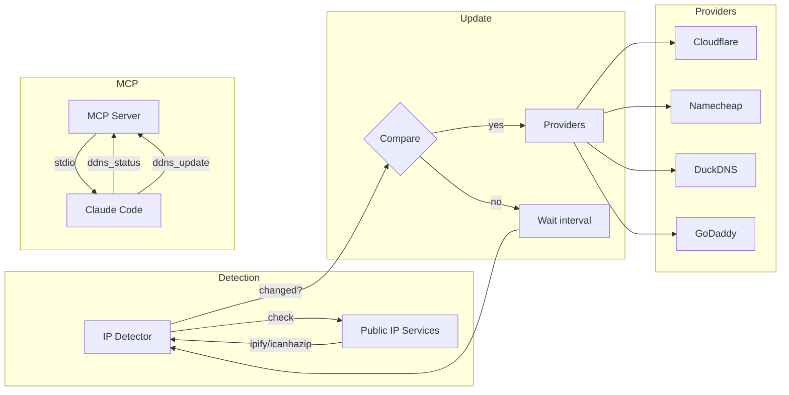
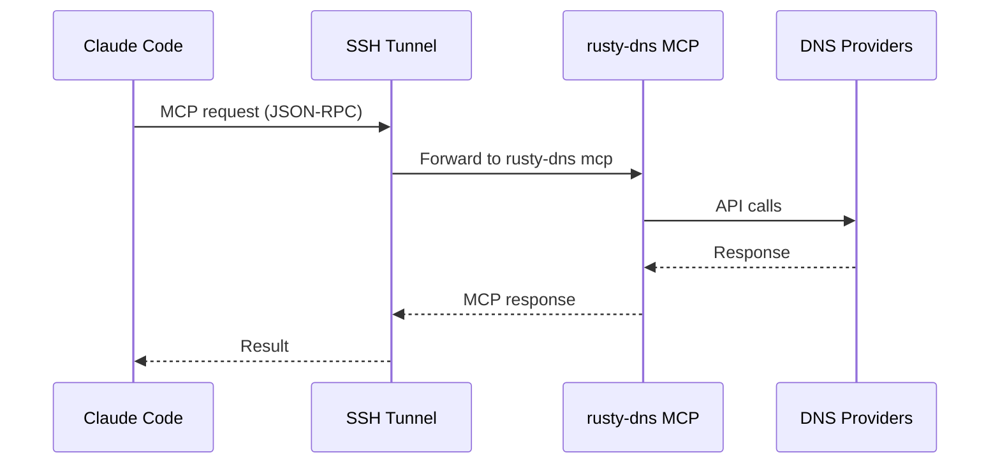

# rusty-dns

Dynamic DNS client with MCP support for AI assistants.

A lightweight, Rust-based DDNS client that supports multiple providers and integrates with AI assistants via the Model Context Protocol (MCP).

## Features

- **Multi-Provider Support**: Cloudflare, Namecheap, DuckDNS, GoDaddy
- **MCP Integration**: Configure and manage via Claude Code or other AI assistants
- **Daemon Mode**: Run as a background service with configurable check intervals
- **Environment Variables**: Secure secrets via `$VAR_NAME` syntax
- **Remote Management**: SSH tunnel support for Raspberry Pi/server management

## Installation

```bash
# Build from source
cargo build --release

# Install
cp target/release/rusty-dns ~/.local/bin/
```

## Quick Start

1. Create config file:

```bash
mkdir -p ~/.config/rusty-dns
cat > ~/.config/rusty-dns/config.toml << 'EOF'
check_interval_secs = 300

[[providers]]
type = "cloudflare"
api_token = "$CF_API_TOKEN"
zone_id = "your-zone-id"
record_name = "home.example.com"
proxied = false
EOF
```

2. Set environment variables:

```bash
export CF_API_TOKEN="your-cloudflare-api-token"
```

3. Run:

```bash
rusty-dns status    # Check current status
rusty-dns update    # Update DNS records
rusty-dns daemon    # Run as daemon
```

## Architecture



## CLI Commands

```bash
rusty-dns status              # Show current IP and provider status
rusty-dns update              # Update DNS if IP changed
rusty-dns update --force      # Force update even if unchanged
rusty-dns daemon              # Run as daemon (default: 5 min interval)
rusty-dns daemon -i 60        # Custom interval (60 seconds)
rusty-dns mcp                 # Run MCP server over stdio
rusty-dns validate            # Validate configuration
```

## Configuration

### Config File

Location: `~/.config/rusty-dns/config.toml`

```toml
# Check interval (default: 300 seconds)
check_interval_secs = 300

# IP detection services (optional, has sensible defaults)
ip_services = [
    "https://api.ipify.org",
    "https://icanhazip.com",
    "https://ifconfig.me/ip",
    "https://ipecho.net/plain"
]

# Cloudflare provider
[[providers]]
type = "cloudflare"
api_token = "$CF_API_TOKEN"
zone_id = "abc123"
record_name = "vpn.example.com"
proxied = false

# Namecheap provider
[[providers]]
type = "namecheap"
domain = "example.com"
host = "vpn"
password = "$NAMECHEAP_DDNS_PASSWORD"

# DuckDNS provider
[[providers]]
type = "duckdns"
domains = "mysubdomain"
token = "$DUCKDNS_TOKEN"

# GoDaddy provider
[[providers]]
type = "godaddy"
api_key = "$GODADDY_API_KEY"
api_secret = "$GODADDY_API_SECRET"
domain = "example.com"
name = "vpn"
ttl = 600
```

### Environment Variables

Secrets can reference environment variables using `$VAR_NAME` syntax:

```bash
export CF_API_TOKEN="your-cloudflare-token"
export DUCKDNS_TOKEN="your-duckdns-token"
```

## MCP Integration

### Remote Configuration via SSH



Configure in Claude Code (`~/.claude/mcp_servers.json`):

```json
{
  "rusty-dns": {
    "command": "ssh",
    "args": ["-t", "pi@raspberrypi", "rusty-dns", "mcp"]
  }
}
```

### Available MCP Tools

| Tool | Description |
|------|-------------|
| `ddns_status` | Get current IP, provider status, last update time |
| `ddns_update` | Force DNS update (use `force: true` to update even if unchanged) |
| `ddns_history` | Get recent update history |
| `ddns_test_provider` | Test connectivity for a specific provider |
| `ddns_add_provider` | Get instructions for adding a provider |
| `ddns_remove_provider` | Get instructions for removing a provider |

### Example MCP Session

```
> Use rusty-dns to check my current IP and provider status

The rusty-dns tool shows:
- Current public IP: 203.0.113.42
- Cloudflare (vpn.example.com): 203.0.113.42 (healthy)
- DuckDNS (home.duckdns.org): 203.0.113.42 (healthy)
- Last update: 2024-01-15T10:30:00Z

> Force update all DNS records

Updated 2 providers:
- Cloudflare: OK (IP unchanged)
- DuckDNS: OK (IP unchanged)
```

## Service Installation

### Linux (systemd)

```bash
# Copy service file
sudo cp systemd/rusty-dns.service /etc/systemd/system/

# Create environment file for secrets
sudo mkdir -p /etc/rusty-dns
sudo cat > /etc/rusty-dns/env << 'EOF'
CF_API_TOKEN=your-cloudflare-token
DUCKDNS_TOKEN=your-duckdns-token
EOF
sudo chmod 600 /etc/rusty-dns/env

# Enable and start
sudo systemctl daemon-reload
sudo systemctl enable --now rusty-dns

# Check status
sudo systemctl status rusty-dns
journalctl -u rusty-dns -f
```

### macOS (launchd)

**System-wide daemon** (runs as root, starts at boot):

```bash
# Copy daemon plist
sudo cp launchd/com.rusty-dns.daemon.plist /Library/LaunchDaemons/

# Create working directory
sudo mkdir -p /var/lib/rusty-dns

# Load and start
sudo launchctl load -w /Library/LaunchDaemons/com.rusty-dns.daemon.plist

# Check status
sudo launchctl list | grep rusty-dns
tail -f /var/log/rusty-dns.log
```

**User agent** (runs as current user, starts at login):

```bash
# Copy agent plist
cp launchd/com.rusty-dns.agent.plist ~/Library/LaunchAgents/

# Load and start
launchctl load -w ~/Library/LaunchAgents/com.rusty-dns.agent.plist

# Check status
launchctl list | grep rusty-dns
tail -f /tmp/rusty-dns.log
```

**Uninstall:**

```bash
# System daemon
sudo launchctl unload /Library/LaunchDaemons/com.rusty-dns.daemon.plist
sudo rm /Library/LaunchDaemons/com.rusty-dns.daemon.plist

# User agent
launchctl unload ~/Library/LaunchAgents/com.rusty-dns.agent.plist
rm ~/Library/LaunchAgents/com.rusty-dns.agent.plist
```

## Providers

### Cloudflare

Uses the Cloudflare API v4. Requires:
- API Token with `Zone:DNS:Edit` permission
- Zone ID (found in Cloudflare dashboard)
- Existing DNS record name

### Namecheap

Uses Namecheap Dynamic DNS. Requires:
- Domain registered with Namecheap
- Dynamic DNS password (from Advanced DNS settings)
- Dynamic DNS enabled for the host

### DuckDNS

Free DDNS service. Requires:
- DuckDNS subdomain
- DuckDNS token (from duckdns.org)

### GoDaddy

Uses GoDaddy Domains API. Requires:
- API Key and Secret (from developer.godaddy.com)
- Production API access (not OTE)

## Development

```bash
# Build
cargo build

# Test
cargo test

# Run in development
cargo run -- status

# Build release
cargo build --release
```

## License

MIT OR Apache-2.0
